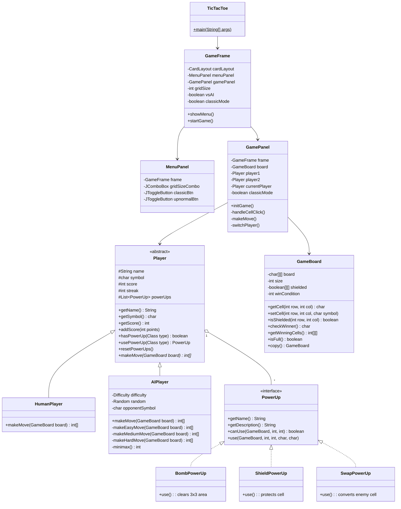

# Laporan Proyek: Tic Tac Toe - Paper & Pencil Edition

---

## 1. Judul

**Tic Tac Toe - Paper & Pencil Edition**

Game Tic Tac Toe dengan tampilan minimalis seperti coretan di buku tulis, dilengkapi dengan dua mode permainan: Classic dan Upnormal.

---

## 2. Deskripsi

### Gambaran Umum
Aplikasi ini adalah permainan Tic Tac Toe yang dikembangkan menggunakan Java Swing dengan tema visual "Paper & Pencil" - tampilan minimalis yang menyerupai coretan pensil di buku tulis.

### Fitur Utama

| Fitur | Deskripsi |
|-------|-----------|
| **Mode Classic** | Permainan standar 3x3 tanpa power-ups |
| **Mode Upnormal** | Permainan 5x5 atau 7x7 dengan power-ups |
| **vs Computer** | Bermain melawan AI dengan 3 tingkat kesulitan |
| **2 Players** | Bermain berdua secara bergantian |
| **Power-Ups** | Bomb, Shield, Swap (hanya mode Upnormal) |

### Power-Ups (Mode Upnormal)

| Power-Up | Fungsi |
|----------|--------|
| **Bomb** | Membersihkan area 3x3 dari semua simbol |
| **Shield** | Melindungi cell milik sendiri dari Swap |
| **Swap** | Mengubah simbol lawan menjadi milik sendiri |

### Tingkat Kesulitan AI

| Level | Algoritma |
|-------|-----------|
| Easy | Random move |
| Medium | 50% Minimax, 50% random |
| Hard | Minimax dengan Alpha-Beta Pruning |

---

## 3. Rancangan Kelas

### Class Diagram

### Penjelasan Relasi Kelas

| Relasi | Deskripsi |
|--------|-----------|
| `Player` → `HumanPlayer`, `AIPlayer` | Inheritance - Player adalah abstract class |
| `PowerUp` → `BombPowerUp`, `ShieldPowerUp`, `SwapPowerUp` | Implementation - PowerUp adalah interface |
| `Player` ◇ `PowerUp` | Aggregation - Player memiliki list PowerUp |
| `GamePanel` → `GameBoard`, `Player` | Association - GamePanel menggunakan kedua class |
| `GameFrame` → `MenuPanel`, `GamePanel` | Composition - GameFrame memiliki kedua panel |

---

## 4. Gambar Aplikasi dan Penjelasan

### 4.1 Menu Utama (Classic Mode)

**Penjelasan:**
- **Game Type**: Pilihan antara Classic (3x3) dan Upnormal (5x5/7x7)
- **Player Mode**: vs Computer atau 2 Players
- **AI Difficulty**: Easy, Medium, atau Hard
- Tampilan menggunakan tema paper & pencil dengan warna cream

---

### 4.2 Menu Utama (Upnormal Mode)

**Penjelasan:**
- Muncul pilihan **Grid Size** (5x5 atau 7x7)
- Muncul informasi **Power-Ups** yang tersedia
- Power-ups: Bomb, Shield, Swap

---

### 4.3 Permainan Classic Mode

**Penjelasan:**
- Grid 3x3 standar
- X = warna biru pensil
- O = warna merah pensil
- Tidak ada power-ups
- Panel kiri/kanan menampilkan score pemain

---

### 4.4 Permainan Upnormal Mode

**Penjelasan:**
- Grid 5x5 atau 7x7
- Terdapat tombol power-up di bagian bawah
- Player dapat menggunakan Bomb, Shield, atau Swap
- Sel yang di-shield ditandai dengan warna biru muda

---

### 4.5 Tampilan Kemenangan

**Penjelasan:**
- Sel pemenang ditandai dengan warna hijau
- Status menampilkan pemenang dan poin yang didapat
- Streak bonus ditambahkan jika menang berturut-turut

---

## Teknologi yang Digunakan

| Teknologi | Penggunaan |
|-----------|------------|
| Java SE | Bahasa pemrograman utama |
| Java Swing | Framework GUI |
| AWT Graphics2D | Custom rendering untuk tema |
| Minimax Algorithm | AI untuk mode Hard |
| Alpha-Beta Pruning | Optimasi algoritma Minimax |

---

*Laporan ini dibuat untuk mata kuliah PBO B*
