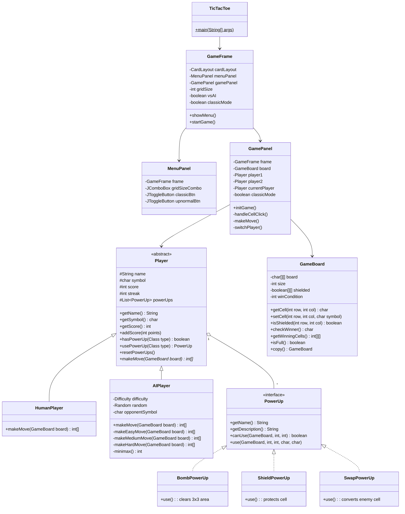

# Final Project - Pemrograman Berorientasi Objek B

> Anggota kelompok

| Name | NRP | 
| ---- | --- |
| Aminudin Wijaya  | 5025241242 |
| M. Hilman Azhar  | 5025241264 |
| A. Wildan Kevin Assyauqi  | 5025241265 |


## Deskripsi

Assalamualaikum Warahmatullahi Wabarakatuh,

Pada Tugas Akhir Semester dalam kelas Pemrograman Berorientasi Objek kelas B.
Saya ditugaskan untuk membuat sebuah game menggunakan bahasa `Java` dengan menerapkan konsep OOP.

Game yang saya buat adalah **Tic Tac Toe - Paper & Pencil Edition** dengan tampilan minimalis seperti coretan pensil di buku tulis.

Aplikasi ini merupakan program **berbasis GUI (Graphical User Interface)** menggunakan **Java Swing** dengan konsep **Object-Oriented Programming (OOP)**.
Game ini memiliki dua mode permainan: Classic (3x3) dan Upnormal (5x5/7x7 dengan power-ups).

---

## Preview dan Penjelasan

### Penjelasan Singkat

Untuk project kali ini diperlukan 12 class, yang dibagi menjadi beberapa kategori:

**Class Utama:**
- [`TicTacToe`](src/TicTacToe.java) - Entry point program
- [`GameFrame`](src/GameFrame.java) - Window utama
- [`MenuPanel`](src/MenuPanel.java) - Panel menu
- [`GamePanel`](src/GamePanel.java) - Panel permainan

**Class Player:**
- [`Player`](src/Player.java) - Abstract class untuk pemain
- [`HumanPlayer`](src/HumanPlayer.java) - Pemain manusia
- [`AIPlayer`](src/AIPlayer.java) - Pemain komputer dengan AI

**Class Game Logic:**
- [`GameBoard`](src/GameBoard.java) - Papan permainan

**Class Power-Up:**
- [`PowerUp`](src/PowerUp.java) - Interface power-up
- [`BombPowerUp`](src/BombPowerUp.java) - Power-up Bomb
- [`ShieldPowerUp`](src/ShieldPowerUp.java) - Power-up Shield
- [`SwapPowerUp`](src/SwapPowerUp.java) - Power-up Swap

---

### a. TicTacToe Class (Main)
Kode lengkap dapat diakses [di sini](src/TicTacToe.java)

#### Penjelasan TicTacToe
Class `TicTacToe` berfungsi sebagai **entry point** dari program.
Di dalamnya cuma ada satu baris kode untuk membuat objek `GameFrame` yang akan menampilkan window game.

---

### b. GameFrame Class
Kode lengkap dapat diakses [di sini](src/GameFrame.java)

#### Penjelasan GameFrame
Class `GameFrame` berfungsi sebagai **window utama** aplikasi.
Class ini mengatur tampilan dan navigasi antar panel (menu dan game).

Fitur-fitur penting:
- **Menyimpan pengaturan game** seperti ukuran grid, mode AI, dan tingkat kesulitan.
- **Mengatur tema warna** Paper & Pencil (cream, biru pensil, merah pensil).
- **Mengatur font** handwritten style menggunakan Segoe Print.
- **Inner class NeonButton** untuk tombol dengan efek hover.
- **Inner class GradientPanel** untuk panel dengan background seperti kertas buku tulis.

---

### c. Player Class (Abstract)
Kode lengkap dapat diakses [di sini](src/Player.java)

#### Penjelasan Player
Class `Player` adalah **abstract class** yang menjadi template untuk semua jenis pemain.

Atribut:
- `name` → nama pemain
- `symbol` → simbol pemain (X atau O)
- `score` → skor pemain
- `streak` → berapa kali menang berturut-turut
- `powerUps` → daftar power-up yang dimiliki

Method penting:
- `hasPowerUp()` → cek apakah punya power-up tertentu
- `usePowerUp()` → gunakan power-up
- `resetPowerUps()` → reset power-up ke kondisi awal
- `makeMove()` → method abstract yang harus diimplementasi subclass

---

### d. AIPlayer Class
Kode lengkap dapat diakses [di sini](src/AIPlayer.java)

#### Penjelasan AIPlayer
Class `AIPlayer` adalah subclass dari `Player` yang mengimplementasi **AI untuk bermain melawan komputer**.

Tingkat kesulitan:
- **Easy** → gerakan random
- **Medium** → 50% Minimax, 50% random
- **Hard** → Minimax dengan Alpha-Beta Pruning (optimal)

Method `minimax()` adalah algoritma yang membuat AI bisa memprediksi langkah terbaik dengan mempertimbangkan semua kemungkinan langkah ke depan.

---

### e. GameBoard Class
Kode lengkap dapat diakses [di sini](src/GameBoard.java)

#### Penjelasan GameBoard
Class `GameBoard` berfungsi untuk **menyimpan dan mengelola papan permainan**.

Atribut:
- `board` → array 2D untuk menyimpan simbol
- `size` → ukuran grid (3, 5, atau 7)
- `shielded` → array 2D untuk menandai cell yang di-shield
- `winCondition` → jumlah simbol berurutan untuk menang

Method penting:
- `setCell()` → menempatkan simbol di cell
- `checkWinner()` → mengecek apakah ada pemenang
- `getWinningCells()` → mendapatkan posisi cell pemenang
- `copy()` → membuat salinan board (untuk AI Minimax)

---

### f. PowerUp Interface
Kode lengkap dapat diakses [di sini](src/PowerUp.java)

#### Penjelasan PowerUp
`PowerUp` adalah **interface** yang mendefinisikan kontrak untuk semua power-up.

Method yang harus diimplementasi:
- `getName()` → nama power-up
- `getDescription()` → deskripsi power-up
- `canUse()` → cek apakah bisa digunakan
- `use()` → gunakan power-up

Implementasi:
- **BombPowerUp** → membersihkan area 3x3
- **ShieldPowerUp** → melindungi cell dari Swap
- **SwapPowerUp** → mengubah simbol lawan jadi milik kita

---

## Class Diagram





---

## Fitur Utama

| Fitur | Penjelasan |
|-------|------------|
| **Classic Mode** | Permainan standar 3x3 tanpa power-ups |
| **Upnormal Mode** | Permainan 5x5 atau 7x7 dengan power-ups |
| **vs Computer** | Bermain melawan AI dengan 3 tingkat kesulitan |
| **2 Players** | Bermain berdua secara bergantian |
| **Power-Ups** | Bomb, Shield, Swap (khusus Upnormal) |

---

## Cara Menjalankan Program

1. Buka terminal/command prompt
2. Masuk ke folder `src`
3. Compile semua file Java:
   ```
   javac -encoding UTF-8 *.java
   ```
4. Jalankan program:
   ```
   java TicTacToe
   ```
5. Game akan muncul dan siap dimainkan!

---

## Preview

### a. Menu Utama (Classic Mode)
Tampilan menu dengan pilihan Game Type, Player Mode, dan AI Difficulty.
Di Classic Mode, pilihan Grid Size tidak muncul karena selalu 3x3.

### b. Menu Utama (Upnormal Mode)
Ketika memilih Upnormal, muncul pilihan Grid Size (5x5 atau 7x7) dan informasi Power-Ups yang tersedia.

### c. Tampilan Permainan
- X berwarna biru pensil
- O berwarna merah pensil
- Panel kiri/kanan menampilkan score dan streak pemain
- Di mode Upnormal, ada tombol power-up di bawah

### d. Tampilan Kemenangan
Cell pemenang ditandai dengan warna hijau dan status menampilkan poin yang didapat.

---

## Teknologi yang Digunakan

| Teknologi | Penggunaan |
|-----------|------------|
| Java SE | Bahasa pemrograman utama |
| Java Swing | Framework GUI |
| Graphics2D | Custom rendering untuk tema |
| Minimax Algorithm | AI untuk mode Hard |
| Alpha-Beta Pruning | Optimasi algoritma AI |

---

